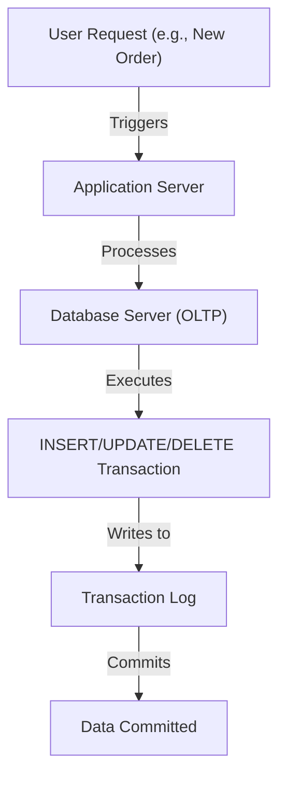
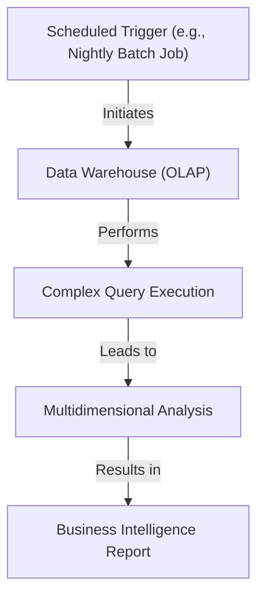
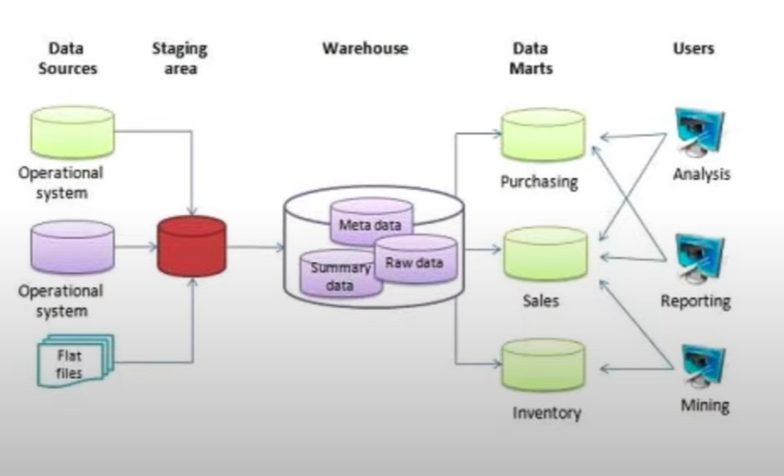
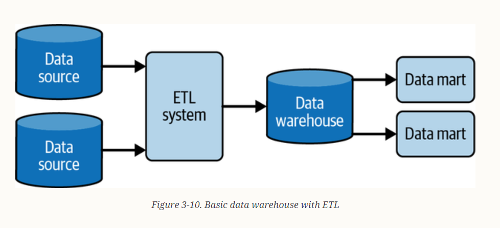
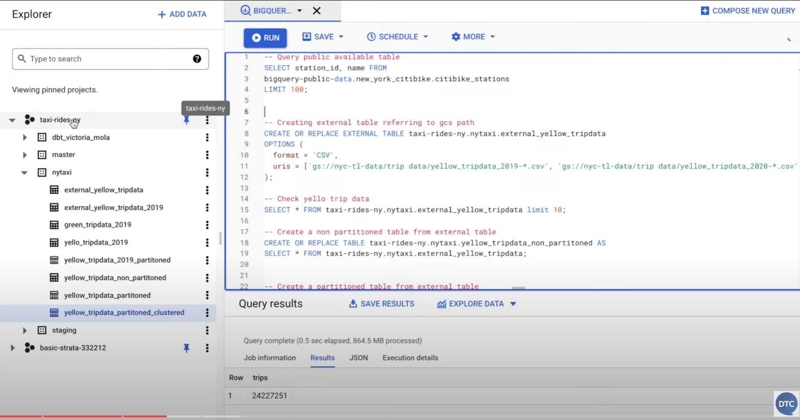
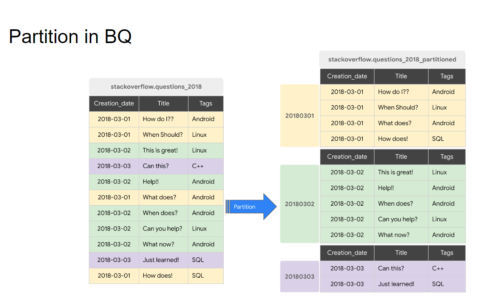
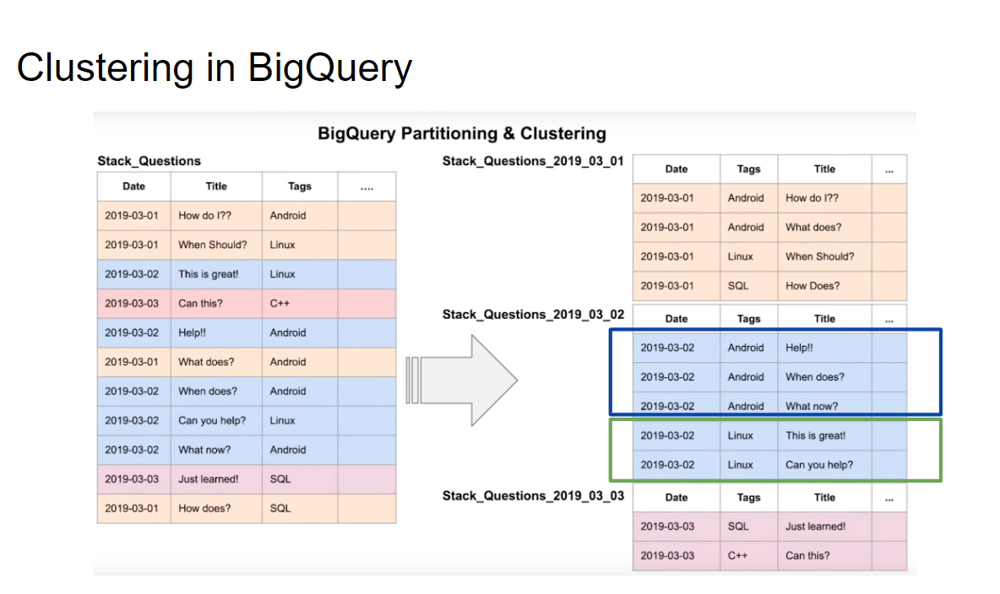

# 3.1.1 Data Warehouse and BigQuery

## OLAP vs OLTP

### OLAP vs. OLTP: Key Differences

In the realm of data management, OLTP (Online Transaction Processing) and OLAP (Online Analytical Processing) systems are foundational, yet they serve distinct purposes. OLTP systems are the backbone of daily operations, handling real-time transactions with efficiency and reliability. They're designed for tasks like inventory management and processing customer orders. On the flip side, OLAP systems are the analytical engines that power strategic decision-making. They excel in analyzing data from multiple perspectives, uncovering insights that drive business strategies and improvements.

This contrast underlines the critical choice between operational efficiency and analytical depth, emphasizing the need to select the right system based on the task at hand. While OLTP systems ensure the smooth running of day-to-day activities, OLAP systems open the door to data-driven insights and long-term planning.

### OLTP Systems
OLTP systems are designed for managing transaction-oriented tasks. Their architecture supports a high volume of short, atomic transactions. These systems prioritize straightforward operations such as INSERT, UPDATE, DELETE, ensuring immediate consistency to maintain the accuracy and reliability of transactional data. OLTP systems employ normalization to minimize data redundancy and maintain data integrity.

- **Normalization**: Organizes database data to reduce redundancy and improve data integrity.
- **Atomic Transactions**: Ensures each transaction is treated as a single, indivisible unit, completing entirely or not at all.
- **Concurrency Control**: Designed to handle numerous users simultaneously, OLTP systems use advanced locking mechanisms or multi-version concurrency control to manage access.

For example, a retail company's inventory management system that processes sales transactions in real-time is an OLTP system.

Flowchart depicting the transaction flow in an OLTP system:

*Figure 1: OLTP System Transaction Flow*

### OLAP Systems
OLAP systems, on the other hand, are built for executing complex queries and are optimized for scenarios with heavy read operations. They enable the analysis of large datasets to identify patterns, trends, and insights, supporting strategic decision-making. OLAP databases often undergo denormalization to improve query performance across extensive datasets.

- **Denormalization**: Increases data redundancy within a database to enhance query performance for complex and large queries.
- **Multidimensional Analysis**: OLAP systems use a multidimensional data model, facilitating advanced calculations, trend analysis, and data mining.
- **Batch Processing**: In OLAP systems, data refreshment is primarily achieved through batch processing. This process is strategically scheduled to align with the organization's operational requirements, often during periods of low activity to reduce the load on operational systems and ensure minimal disruption to critical business functions.

A financial reporting system that analyzes years of transactional data to identify spending trends and forecast budgets is an example of an OLAP system:

*Figure 2: OLAP System Data Analysis Flow*

In summary, OLTP systems underpin the transactional activities that facilitate the day-to-day operations of an organization, while OLAP systems provide the analytical support necessary for strategic decision-making and data analysis. The design of each system type is informed by its specific objectives, influencing how data is stored, accessed, and maintained.

### Analyzing the Differences

The table below contrasts OLTP and OLAP systems across several dimensions, offering insight into their distinct roles, design principles, and use cases within data management.

|               | OLTP                                        | OLAP                                        |
|---------------|---------------------------------------------|---------------------------------------------|
| Purpose       | Control and run essential business operations in real time | Plan, solve problems, support decisions, discover hidden insights |
| Data updates  | Short, fast updates initiated by user    | Data periodically refreshed with scheduled, long-running batch jobs |
| Database design | Normalized databases for efficiency       | Denormalized databases for analysis       |
| Space requirements | Generally small if historical data is archived | Generally large due to aggregating large datasets |
| Backup and recovery | Regular backups required to ensure business continuity and meet legal and governance requirements | Lost data can be reloaded from OLTP database as needed in lieu of regular backups |
| Productivity       | Increases productivity of end users                      | Increases productivity of business managers, data analysts, and executives |
| Data view          | Lists day-to-day business transactions                | Multi-dimensional view of enterprise data               |
| User examples      | Customer-facing personnel, clerks, online shoppers    | Knowledge workers such as data analysts, business analysts, and executives |

## Data Warehouse Architecture Overview

The image illustrates a standard data warehousing architecture, which serves as a centralized repository for data collected from multiple sources. This architecture is designed to support and enhance reporting and analytical capabilities.

- **Data Sources**: Varied operational systems and flat files that provide raw data.
- **Staging Area**: A transitional space where data is cleansed, transformed, and consolidated to ensure quality before it enters the warehouse.
- **Warehouse**: The central repository where processed data is stored. It includes:
  - **Raw Data**: The initial state of data upon entry into the warehouse.
  - **Summary Data**: Aggregated data derived from raw data for efficient analysis.
  - **Metadata**: Descriptive information about the warehouse's data, structure, and usage.
- **Data Marts**: Focused subsets of the data warehouse tailored to specific business functions or departments, facilitating more targeted access and analysis.
- **Users**: End-users who interact with the data through:
  - **Analysis**: Examining trends and patterns.
  - **Reporting**: Creating structured reports for business operations.
  - **Mining**: Discovering hidden patterns using data mining techniques.

This architecture not only segregates the data transformation process from querying and analysis but also ensures performance, scalability, and security. It supports a comprehensive view of the organization's data lifecycle, enabling informed decision-making through business intelligence tools.

<!--  -->

## Data Management Evolution: From OLTP to BigQuery

### Relational Database Management Systems (RDBMS)

When managing transactions, organizations often rely on relational, online transaction processing (OLTP) databases such as MySQL or PostgreSQL. These systems excel in handling real-time, transactional data, offering robust querying capabilities through Structured Query Language (SQL). SQL enables users to perform complex data manipulations without needing high-level programming skills, making it a versatile tool for data analysis.

However, OLTP databases face limitations in executing ad hoc queries that require extensive data traversal. They prioritize data consistency, employing mechanisms like locking to maintain integrity during concurrent reads and writes. This focus on transactional integrity, while crucial, can impede the efficiency of complex analytical queries, especially those involving unindexed columns or requiring significant aggregation and sorting.

### The MapReduce Framework and Hadoop

To address the inefficiencies of OLTP databases for large-scale data analysis, the MapReduce framework, popularized by Google and later Apache Hadoop, introduced a new paradigm. This model allowed for distributed data processing by breaking down tasks into smaller, manageable chunks (map) and then aggregating the results (reduce). Apache Spark, a successor to Hadoop, further streamlined this process, enabling ad hoc SQL queries on distributed datasets.

Despite these advancements, managing a Hadoop cluster introduces its own set of challenges, including provisioning and scaling the infrastructure to match data and analysis growth. This complexity often detracts from an organization's core objectives, necessitating a more scalable and maintenance-free solution.

### BigQuery: A Serverless, Distributed SQL Engine

Enter BigQuery, Google's serverless data warehouse solution, which marries the simplicity and familiarity of SQL with the scalability and performance of distributed data processing. BigQuery eliminates the need for infrastructure management, allowing users to focus on data analysis rather than operational overhead.

#### Key Advantages of BigQuery

- **Serverless Architecture**: Removes the complexities of server management and software installation, significantly reducing operational costs.
- **Scalability and Performance**: Auto-scales from gigabytes to petabytes, ensuring high availability for business-critical applications.
- **Advanced Features**: Incorporates machine learning, geospatial analysis, and business intelligence capabilities directly within the data warehouse.
- **Cost-Effectiveness**: Offers a flexible pricing model, separating storage and compute costs to optimize both performance and expenditure.

BigQuery's serverless approach, combined with its powerful analytics capabilities, positions it as an ideal platform for modern data warehousing needs. It supports efficient, distributed data traversal, enabling rapid insights even across vast datasets, as demonstrated by the ability to process and analyze years of transactional data in seconds.

## BigQuery Interface and Usage

BigQuery offers a user-friendly interface that significantly simplifies the interaction with large datasets and complex queries, embodying its serverless, scalable architecture in a tangible way.

### Interface Highlights

- **Project and Dataset Identification**: Clearly displays the project name (`taxi right ny`) and the datasets within it, such as `ny taxi`, facilitating easy navigation and management of data resources.
- **Table Management**: Provides straightforward access to tables, including `external yellow trip data` and `external yellow data 2019`, streamlining the management and exploration of data.
- **Data Caching**: Enhances query performance through result caching, a feature that can be disabled to ensure consistency in demonstrations and analyses.
- **Public Data Access**: Grants access to a vast collection of open-source public datasets, such as the New York City bike (`city bike stations`) data, encouraging open data exploration and sharing.
- **Search Functionality**: Enables quick dataset discovery with a search bar for table names, improving efficiency in data retrieval.
- **Table Details**: Offers critical insights into tables, including column names, row counts, and table size, aiding in data assessment and planning.
- **Data Preview**: Allows users to preview table data, providing a snapshot of the data's structure and content before deep analysis.
- **Query Execution**: Facilitates direct query execution within the interface, with immediate viewing of results, exemplifying BigQuery's powerful analytical capabilities.
- **Export and Integration**: Supports exporting query results to CSV for further analysis or integration with tools like Google Data Studio, enhancing data portability and visualization.

This interface, with its emphasis on ease of use and accessibility, underscores BigQuery's commitment to democratizing data analysis, enabling users of varying technical backgrounds to leverage powerful data processing and analytical tools without the need for extensive infrastructure management.

## BigQuery Cost Structure

BigQuery offers two primary pricing models to accommodate different usage patterns and needs.

### On-Demand Pricing
- **Cost per Usage**: $5 for every terabyte of data processed.
- **Flexibility**: Ideal for variable workloads with no upfront costs.
- **Convenience**: Pay only for the amount of data you query.

### Flat Rate Pricing
- **Slot-Based**: Pricing is based on the number of slots you pre-purchase.
- **Predictable Costs**: 100 slots cost approximately $2,000 per month.
- **Equivalent On-Demand Processing**: Roughly translates to 400 TB of data processed on-demand.
- **Considerations**:
  - Cost-effective for large-scale, consistent workloads.
  - Not recommended unless processing well over 200 TB of data.
  - Query concurrency: With limited slots, queries may queue up, but this is not an issue with on-demand pricing.

The choice between on-demand and flat rate pricing depends on the scale of data processing and the predictability of your workload. On-demand pricing offers flexibility for sporadic querying, while flat rate is more economical for heavy, consistent usage.

## Partitioning in BigQuery

Partitioning is a performance optimization feature in BigQuery that can significantly reduce query costs and improve efficiency.

### Understanding Partitions

- **Purpose**: Partitions help organize data by dividing a large table into smaller, manageable segments based on specific column values.
- **Common Use Case**: Often used with date columns to filter and query data for specific time periods.

### Benefits of Partitioning

- **Performance Improvement**: By partitioning a table by date, BigQuery processes only the data relevant to the query, ignoring the rest.
- **Cost Reduction**: Less data processed means lower costs. For example, querying only data from the 2nd of March 2018 will not process data from the 1st or 3rd of March 2018.

### Example

- **Original Table**: `stackoverflow.questions_2018` with columns `Creation_date`, `Title`, and `Tags`.
- **Partitioned Table**: `stackoverflow.questions_2018_partitioned`, organized into partitions such as `20180301`, `20180302`, and `20180303`, each containing data for their respective dates.

Partitioning is particularly effective for queries that are frequently filtered by the partitioned column, making it a strategic choice for optimizing BigQuery workloads.

## Clustering in BigQuery

Clustering is an advanced feature in BigQuery that enhances data analysis efficiency by organizing data within each partition.

### Understanding Clustering

- **Purpose**: Clustering sorts and organizes data in a partitioned table based on the contents of one or more columns.
- **Benefits**: Improves query performance by reducing the amount of data read during a query and can lead to cost savings.

### Example of Clustering

- **Original Table**: `Stack_Questions` with columns `Date`, `Title`, and `Tags`.
- **Clustered Table**: After clustering, the table `Stack_Questions_2019_03_02` shows data organized by the `Tags` column within each date partition.

### Performance and Cost Impact

- **Query Efficiency**: A query on a non-clustered table might process more data, e.g., 1.6 GB, while the same query on a clustered table might only process 106 MB.
- **Cost Savings**: Processing less data means lower costs, especially beneficial for repeated queries over large datasets.

### Managing Clusters

- **Viewing Clusters**: BigQuery provides information on how many rows fall into each cluster, helping identify any skew in data distribution.
- **Bias in Clusters**: It's important to monitor if some clusters have significantly more data than others, which could affect query performance.

Clustering, when combined with partitioning, can significantly optimize BigQuery queries, making it a powerful tool for managing large-scale data warehouses efficiently.